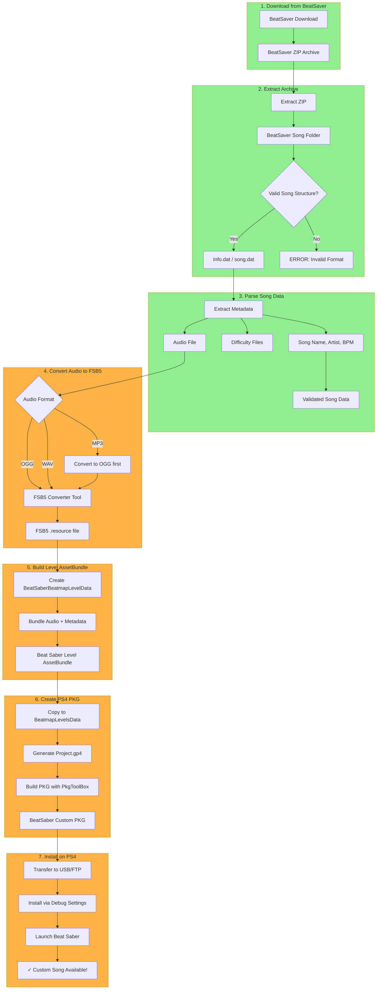
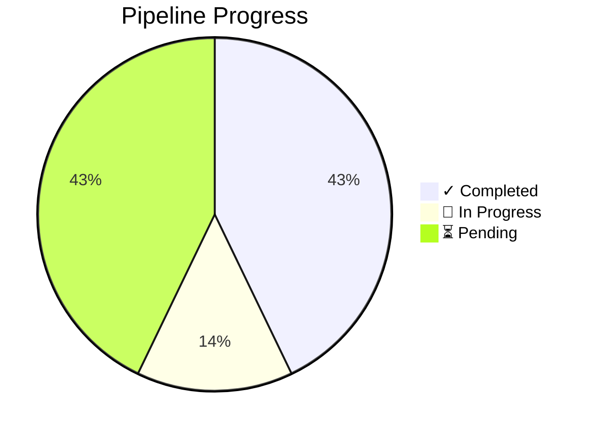
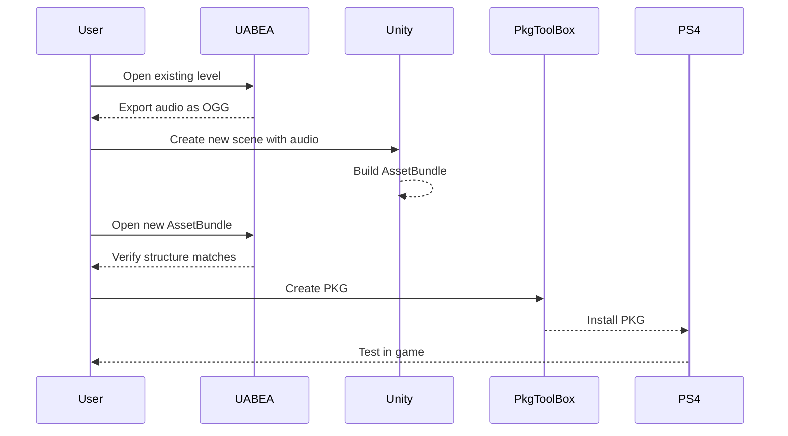

# Beat Saber PS4 Custom Songs - Pipeline Status

## End-to-End Pipeline Overview

## Step Status Legend

## Detailed Step Status

| Step | Status | Description | Evidence |
|------|--------|-------------|----------|
| **1. Download from BeatSaver** | ✅ Done | BeatSaver ZIP format confirmed | `songs_repo/` contains 20+ songs |
| **2. Extract Archive** | ✅ Done | ZIP extraction works | `python zipfile` handles correctly |
| **3. Parse Song Data** | ⚠️ Partial | Info.dat parsing works, need beatmap converter | `beatsaber_asset_tool.py` has template |
| **4. Convert Audio to FSB5** | ⚠️ Unity | **Unity 2022.3 project created!** | `unity_project/` ready to test |
| **5. Build Level AssetBundle** | ⚠️ Unity | Unity project can build AssetBundles | Script ready, needs testing |
| **6. Create PS4 PKG** | ⚠️ Partial | PKG building works | `PkgToolBox` tested, working |
| **7. Install on PS4** | ⏳ Pending | Need full pipeline test | GoldHEN + debug settings ready |

## Key Discoveries

### Audio Format: FSB5
- Beat Saber PS4 uses **FSB5** (FMOD Sound Bank 5) for audio
- NOT raw OGG - audio is wrapped in FSB5 container
- UABEA can **export** audio as OGG, but import needs FSB5 format
- .resource file size: 7,269,312 bytes (including 900 byte FSB5 header)

### AssetBundle Structure
- Each level is a single AssetBundle file (e.g., `beatsaber`)
- Contains: `BeatSaberBeatmapLevelData` + `AudioClip` + other assets
- AudioClip points to external .resource file via `archive:/CAB-.../resource` path
- Levels auto-load from `BeatmapLevelsData/` directory

### PKG Building
- `PkgToolBox` successfully creates valid PKGs
- Previous build: 94 songs, 1.1 GB (working!)
- PKG installs via GoldHEN debug settings

## Current Blocker

### Audio Replacement
**Problem:** UABEA cannot import external audio directly

**Options:**
1. Build FSB5 encoder (complex - requires FMOD SDK)
2. Use Unity 2022.3 to rebuild AssetBundles (requires Unity install)
3. Direct hex replacement if sizes match (risky)

**Recommendation:** Test Unity + UABEA workflow for AssetBundle creation

## Immediate Next Steps

## File Inventory

| File | Purpose | Status |
|------|---------|--------|
| `song_replacer.py` | Song metadata templates | ✅ Working |
| `beatsaber_asset_tool.py` | AssetBundle analysis | ✅ Working |
| `docs/FSB5_FORMAT_DISCOVERY.md` | Audio format documentation | ✅ Done |
| `docs/SIMPLIFIED_APPROACH.md` | No-plugin approach | ✅ Done |
| `docs/MANUAL_UNITY_WORKFLOW.md` | UABEA/Unity guide | ✅ Updated |
| `docs/PIPELINE_STATUS.md` | This document | ✅ Current |

## Questions to Answer

1. Can Unity 2022.3 create Beat Saber-compatible AssetBundles?
2. Does UABEA import work for .resource files with FSB5?
3. Can we test PKG build with existing (unmodified) levels first?

## Success Criteria

- [ ] Replace audio in one level (beatsaber → test song)
- [ ] Build PKG with modified level
- [ ] Install and verify on PS4
- [ ] Audio plays correctly in game
- [ ] Expand to batch processing